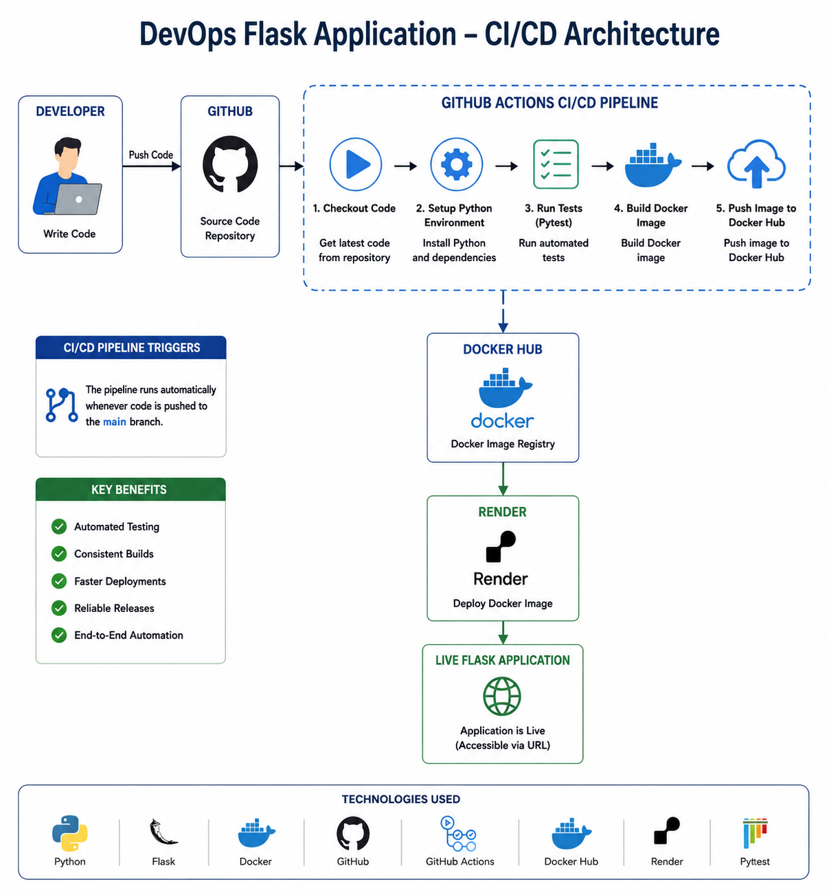

1. DevOps Flask Application

A containerized Flask web application with an automated CI/CD pipeline using GitHub Actions, Docker, Docker Hub, and Render.

 🚀 Tech Stack

- Python
- Flask
- Docker
- Git & GitHub
- GitHub Actions
- Docker Hub
- Render
- Pytest

 🏗️ Architecture

 

Developer
   ↓
GitHub
   ↓
GitHub Actions
   ↓
Run Tests
   ↓
Build Docker Image
   ↓
Docker Hub
   ↓
Render
   ↓
Live Flask Application

 ⚙️ CI/CD Pipeline

Whenever code is pushed to the `main` branch:

1. GitHub Actions checks out the code.
2. Python environment is configured.
3. Dependencies are installed.
4. Pytest runs automated tests.
5. Docker image is built.
6. Docker Hub authentication is performed.
7. Docker image is pushed to Docker Hub.
8. Render deploys the application.

 🐳 Run Locally

Clone the repository:

git clone https://github.com/Prathikshashetty0115/DevOps-Flask-App.git

Go into the project:

cd DevOps-Flask-App

Build the Docker image:

docker build -t devops-flask-app .

Run the container:

docker run -d -p 5000:5000 --name devops-flask-container devops-flask-app

Open:

http://localhost:5000

 🧪 Run Tests

python -m pytest

 🌐 Deployment

The application is deployed using Render and is automatically updated through the CI/CD workflow.

 📌 Project Highlights

- Containerized Flask application using Docker
- Automated testing with Pytest
- CI/CD implementation using GitHub Actions
- Automated Docker image publishing to Docker Hub
- Cloud deployment using Render
